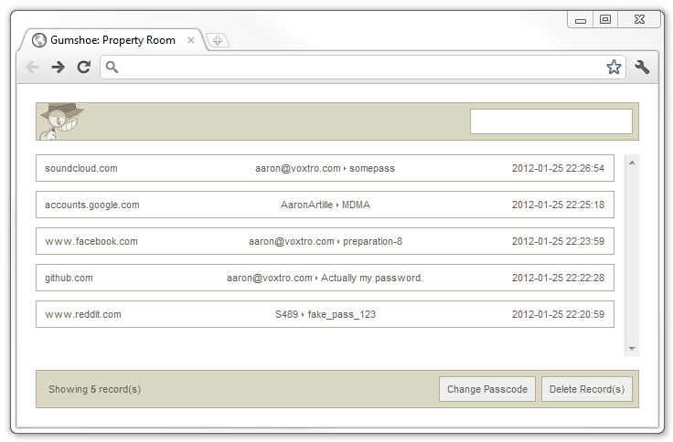

# Gumshoe Remake
Recreated Gumshoe extension that works! Original repo: [click for more informations](https://github.com/ajar/gumshoe)
Gumshoe is a Chrome extension for discreet password logging. It monitors the submission of all forms with a password field and stores any unique login details in a local database.
_______________________________________________________________________________________
I am not the original author or creator of the extension – I only updated it. Have fun!

# How to import extension into browser? 
1. Download the package from the [release](https://github.com/RETR0originall-Git/gumshoe-remake/releases/tag/MainRelease1.1), **and make sure to get the latest version!**
2. Extract it to any location on your computer. (Extract to folder **'src'**)
3. Go to your browser’s extension settings, enable Developer Mode, then click 'Load/Import unpacked' and select the extracted folder **'src'** from the package.
4. Now you can open 'Property Room' in options extension. If you find some problems or bugs, you can try contact with me.

# Is it safe?
Yep. But in your case it depends, the extension is open-source so you always free to see code.
The remake doesn't change any other things, your password, emails are still save in local Data Base, you don't have to panic.
Everything locally, in other ways: I can't steal your data.

# Screenshot

# About the extension.
The extension will not be published to the Chrome Web Store due to Google's policies, it was removed a long time ago. The default passcode is: 'gselog', and you can always change it. I am not responsible for your actions using this extension, and I do not recommend using it without authorization on devices belonging to unaware individuals. Please remember that you can use it ethically for your own purposes.
